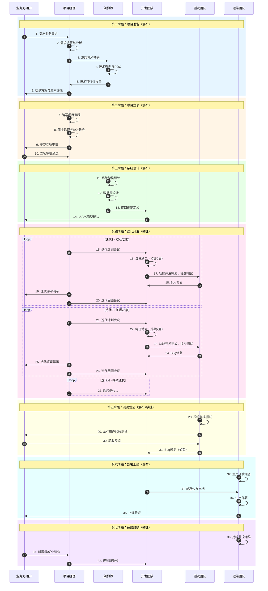

# 项目开发计划（瀑布+敏捷混合模式）

## 概述

本文档定义了系统项目的完整开发流程，采用瀑布模型进行阶段划分，敏捷方法进行迭代执行。

---

## 项目开发步骤计划

### 第一阶段：项目准备（瀑布）
1. **需求调研** → 收集业务需求、用户痛点
2. **技术预研** → 技术选型、架构对比、POC验证
3. **可行性分析** → 成本效益、风险评估
4. **方案设计** → 初步架构、核心流程

### 第二阶段：项目立项（瀑布）
5. **编写项目章程** → 目标、范围、干系人
6. **商业论证** → ROI分析、投资回收期
7. **立项审批** → 决策评审、资源批准

### 第三阶段：系统设计（瀑布）
8. **架构设计** → 技术架构、部署架构
9. **数据库设计** → 数据模型、表结构
10. **接口设计** → API规范、数据格式
11. **UI/UX设计** → 原型图、交互设计

### 第四阶段：迭代开发（敏捷）
12. **迭代1** → 核心功能（2周）
    - 每日站会
    - 持续集成
    - 迭代评审
    - 回顾改进
13. **迭代2** → 扩展功能（2周）
14. **迭代3** → 完善功能（2周）
15. **...** → 持续迭代

### 第五阶段：测试验证（瀑布+敏捷）
16. **单元测试** → 开发同步进行
17. **集成测试** → 每个迭代结束
18. **系统测试** → 全功能验证
19. **UAT测试** → 用户验收

### 第六阶段：部署上线（瀑布）
20. **部署准备** → 环境配置、数据迁移
21. **生产部署** → 上线发布
22. **上线验证** → 功能验证、监控

### 第七阶段：运维维护（敏捷）
23. **持续运维** → 监控、日志、报警
24. **迭代优化** → 持续改进、新需求

---

## 项目流程时序图



---

## 阶段说明

| 阶段 | 模式 | 周期 | 关键产出 |
|------|------|------|----------|
| 1. 项目准备 | 瀑布 | 1-2周 | 需求文档、技术方案 |
| 2. 项目立项 | 瀑布 | 3-5天 | 项目章程、商业论证 |
| 3. 系统设计 | 瀑布 | 2-3周 | 架构设计、接口文档 |
| 4. 迭代开发 | 敏捷 | 2周/迭代 | 可运行软件 |
| 5. 测试验证 | 混合 | 1-2周 | 测试报告 |
| 6. 部署上线 | 瀑布 | 3-5天 | 上线系统 |
| 7. 运维维护 | 敏捷 | 持续 | 稳定运行 |

---

## 关键里程碑

1. **M1 - 立项完成**: 项目章程审批通过
2. **M2 - 设计完成**: 架构设计评审通过
3. **M3 - 首个迭代**: 核心功能可用
4. **M4 - 功能完成**: 所有需求开发完成
5. **M5 - 测试通过**: UAT验收通过
6. **M6 - 正式上线**: 生产环境部署完成

---

## 文档目录结构

```
docs/
├── PROJECT-PLAN.md                 # 本文件：项目总计划
├── 00-project-initiation/          # 项目立项阶段
│   ├── 01-project-charter.md
│   ├── 02-business-case.md
│   ├── 03-stakeholder-register.md
│   ├── 04-project-scope-statement.md
│   ├── 05-assumption-log.md
│   ├── 06-risk-register.md
│   └── 07-milestone-schedule.md
├── 01-requirements/                # 需求分析阶段
├── 02-design/                      # 系统设计阶段
├── 03-iterations/                  # 迭代开发阶段
├── 04-testing/                     # 测试验证阶段
├── 05-deployment/                  # 部署上线阶段
└── 06-operations/                  # 运维维护阶段
```

---

*文档版本: 1.0*
*创建日期: 2026-03-04*
*最后更新: 2026-03-04*
