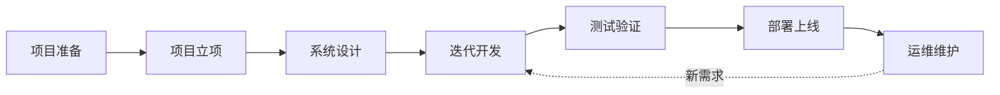

# 项目实施流程图

本文档展示了项目实施的完整流程，采用瀑布+敏捷混合模式，覆盖项目全生命周期的7个阶段。

---

## 流程概览

---

## 第一阶段：项目准备（瀑布）

**周期：** 1-2周  
**关键产出：** 需求文档、技术方案

### 主要活动
1. **需求调研** → 收集业务需求、用户痛点
2. **技术预研** → 技术选型、架构对比、POC验证
3. **可行性分析** → 成本效益、风险评估
4. **方案设计** → 初步架构、核心流程

---

## 第二阶段：项目立项（瀑布）

**周期：** 3-5天  
**关键产出：** 项目章程、商业论证

### 主要活动
1. **编写项目章程** → 目标、范围、干系人
2. **商业论证** → ROI分析、投资回收期
3. **立项审批** → 决策评审、资源批准

---

## 第三阶段：系统设计（瀑布）

**周期：** 2-3周  
**关键产出：** 架构设计、接口文档

### 主要活动
1. **架构设计** → 技术架构、部署架构
2. **数据库设计** → 数据模型、表结构
3. **接口设计** → API规范、数据格式
4. **UI/UX设计** → 原型图、交互设计

---

## 第四阶段：迭代开发（敏捷）

**周期：** 2周/迭代  
**关键产出：** 可运行软件

### 迭代活动
- **迭代计划** → 明确迭代目标和任务
- **每日站会** → 同步进度、识别阻塞
- **持续集成** → 代码提交、自动构建
- **迭代评审** → 演示成果、收集反馈
- **回顾改进** → 总结经验、优化流程

### 迭代节奏
| 迭代 | 目标 | 周期 |
|------|------|------|
| 迭代1 | 核心功能 | 2周 |
| 迭代2 | 扩展功能 | 2周 |
| 迭代3 | 完善功能 | 2周 |
| 迭代N | 持续迭代 | 2周 |

---

## 第五阶段：测试验证（瀑布+敏捷）

**周期：** 1-2周  
**关键产出：** 测试报告

### 测试层级
1. **单元测试** → 开发同步进行
2. **集成测试** → 每个迭代结束
3. **系统测试** → 全功能验证
4. **UAT测试** → 用户验收

---

## 第六阶段：部署上线（瀑布）

**周期：** 3-5天  
**关键产出：** 上线系统

### 主要活动
1. **部署准备** → 环境配置、数据迁移
2. **生产部署** → 上线发布
3. **上线验证** → 功能验证、监控

---

## 第七阶段：运维维护（敏捷）

**周期：** 持续  
**关键产出：** 稳定运行

### 主要活动
1. **持续运维** → 监控、日志、报警
2. **迭代优化** → 持续改进、新需求

---

## 关键里程碑

| 里程碑 | 说明 | 交付物 |
|--------|------|--------|
| **M1** | 立项完成 | 项目章程审批通过 |
| **M2** | 设计完成 | 架构设计评审通过 |
| **M3** | 首个迭代 | 核心功能可用 |
| **M4** | 功能完成 | 所有需求开发完成 |
| **M5** | 测试通过 | UAT验收通过 |
| **M6** | 正式上线 | 生产环境部署完成 |

---

## 模式说明

### 瀑布模式特点
- **适用阶段：** 项目准备、立项、系统设计、部署上线
- **优势：** 阶段清晰、文档完整、风险可控
- **适用场景：** 需求明确、变更较少的前期阶段

### 敏捷模式特点
- **适用阶段：** 迭代开发、运维维护
- **优势：** 快速交付、灵活响应、持续改进
- **适用场景：** 需求可能变化、需要快速验证的开发阶段

### 混合模式优势
- 前期用瀑布确保方向和基础
- 中期用敏捷快速迭代交付
- 后期用瀑布确保稳定上线
- 运维用敏捷持续优化改进

---

*文档版本: 1.0*  
*最后更新: 2026-03-05*
